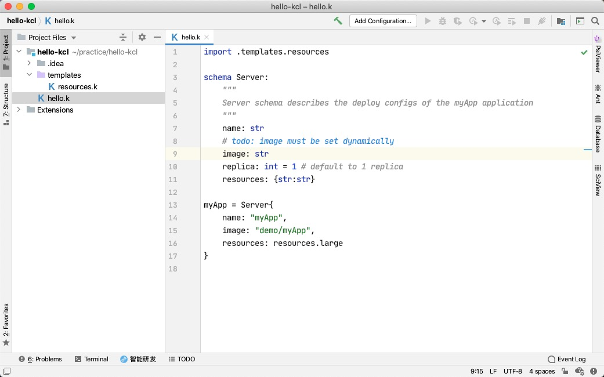
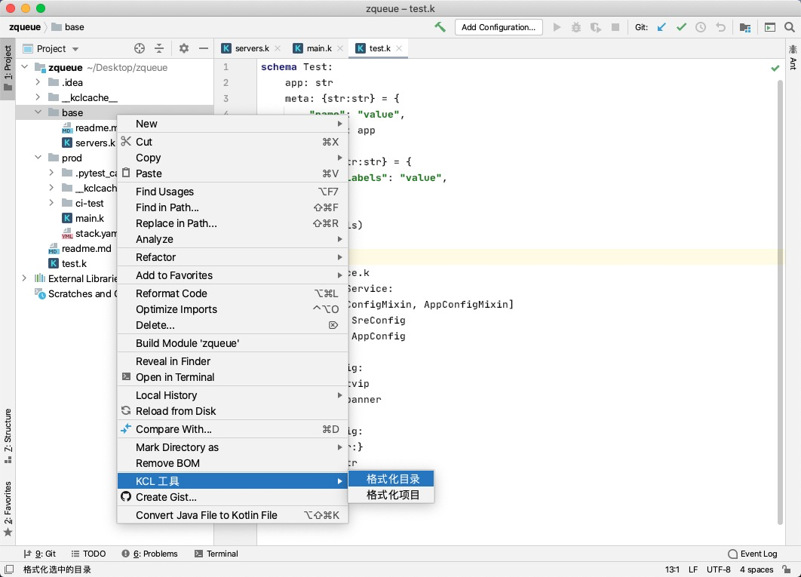

# KCL Plugin for IntelliJ IDEA

The KCL IntelliJ IDEA plugin provides rich language support for the [KCL language](https://kcl-lang.io/).

In addition, we also have a plugin implemented based on the LSP(Language Server Protocol), which can be found [here](https://github.com/kcl-lang/intellij-kcl-lsp)

## Quick Start

Welcome to KCL developing! We hope this plugin enhances your development experience with KCL.

- **Step 1.** [Install KCL](https://kcl-lang.io/docs/user_docs/getting-started/install) on your system.

- **Step 2.** Install the KCL plugin for IntelliJ IDEA in Marketplace. Preference -> plugins -> Marketplace -> search `KCL` -> install -> restart IDE. This plugin requires the IntelliJ IDEA Ultimate 2023.2+

- **Step 3.** Open or create a KCL file and begin your KCL tour!

## Features

This extension provides coding assistance such as basic syntax highlight, IntelliSense such as auto complete, and some basic code navigation. Other useful features such as diagnostics and testing are in developing.

### Highlight

### Completion

This extension provides baisc keywords completion

<!-- ### Code Formatting

Right click on the editor and select KCL Tools -> Format File to format current KCL file:

Right click on the target directory in the project structure panel, select KCL Tools -> Format Directory to format all files under the selected folder:

Right click on the project name in the project structure panel, select KCL Tools -> Format Project to format all files in the project:

 -->

## Ask for help

If the plugin isn't working as you expect, please reach out to us by filing an issue.

## Contributing

We are working actively on improving the KCL development on IntelliJ IDEA, and we welcome all kinds of contributions. You can refer to our [contribution guide](docs/CONTRIBUTING.md). It introduces how to build and run the extension locally.

## License

Apache License Version 2.0
